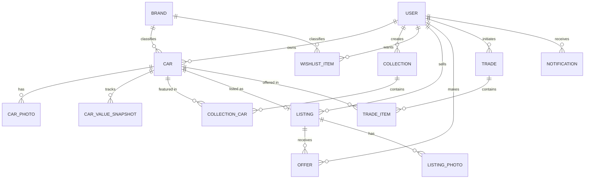

# Data Model

Each entity is tagged with the phase it's needed for (`FUTURE-ROADMAP.md`). Build Phase 1 tables first; later phases extend the schema, they don't replace it.

## Entity Relationship Diagram

---

## User — Phase 1

| Field | Type | Notes |
|---|---|---|
| id | UUID PK | |
| name | text | |
| username | text, unique | used in public URLs (`/u/:username/...`) |
| email | text, unique | |
| password_hash | text | never exposed via API |
| avatar_url | text, nullable | |
| bio | text, nullable | |
| created_at | timestamp | |
| updated_at | timestamp | |

## Brand — Phase 1

| Field | Type | Notes |
|---|---|---|
| id | int/UUID PK | |
| name | text, unique | Hot Wheels, Matchbox, Mini GT, Tomica, Tarmac Works, Auto World, Majorette, GreenLight, Inno64, Kyosho, Other |
| slug | text, unique | |
| logo_url | text, nullable | |
| country | text, nullable | |

## Car — Phase 1

| Field | Type | Notes |
|---|---|---|
| id | UUID PK | |
| user_id | FK → User | |
| brand_id | FK → Brand | |
| model | text | e.g. "Porsche 911 GT3 RS" |
| variant | text, nullable | |
| series | text, nullable | e.g. "Car Culture" |
| year | int, nullable | release year |
| scale | text, nullable | e.g. "1:64" |
| color | text, nullable | |
| condition | enum | `MINT`, `NEAR_MINT`, `GOOD`, `FAIR`, `POOR` |
| packaging_condition | enum | `MOC`, `MIP`, `LOOSE`, `OPENED`, `DAMAGED` |
| hot_wheels_series_type | enum, nullable | `MAINLINE`, `FANTASY` — Hot Wheels only |
| hunt_type | enum, nullable | `NORMAL`, `TREASURE_HUNT`, `SUPER_TREASURE_HUNT` — Hot Wheels only; drives the frontend's default estimated-value multiplier (1x / 2x / 3x of purchase price) |
| purchase_price | numeric | |
| purchase_date | date, nullable | |
| estimated_value | numeric | denormalized "current" value; see `car_value_snapshot` for history |
| quantity | int, default 1 | |
| notes | text, nullable | |
| created_at | timestamp | |
| updated_at | timestamp | |

## CarPhoto — Phase 1

Required by REQUIREMENTS.md ("Upload photos") and the car detail gallery — a car needs more than one image (front/side/rear/packaging).

| Field | Type | Notes |
|---|---|---|
| id | UUID PK | |
| car_id | FK → Car | |
| url | text | a `data:` URI (base64-encoded image), stored inline rather than on disk/object storage |
| position | int | display order |
| is_primary | bool | used as the card thumbnail |
| created_at | timestamp | |

## CarValueSnapshot — Phase 1

Required by REQUIREMENTS.md ("View value history"). A row is written whenever `estimated_value` changes; the collection-value chart aggregates these per user/date.

| Field | Type | Notes |
|---|---|---|
| id | UUID PK | |
| car_id | FK → Car | |
| value | numeric | |
| recorded_at | timestamp | |

## Collection — Phase 1 (private grouping) / Phase 2 (public showcase)

Doubles as a private organizing folder and, once published, a public showcase — same entity, `is_public` gates visibility, matching one `Collection` concept in the original data model.

| Field | Type | Notes |
|---|---|---|
| id | UUID PK | |
| user_id | FK → User | |
| name | text | |
| description | text, nullable | |
| cover_image_url | text, nullable | |
| is_public | bool, default false | Phase 2: publishing sets this true |
| hide_purchase_prices | bool, default true | Phase 2 showcase setting |
| show_estimated_values | bool, default true | Phase 2 showcase setting |
| share_slug | text, unique, nullable | powers `/showcase/:username/:slug` |
| created_at | timestamp | |
| updated_at | timestamp | |

## CollectionCar — Phase 1/2 (join table)

Necessary because a car can belong to multiple collections (e.g. "Porsche Collection" and "Favorites"), and showcase order/cover selection needs to be explicit.

| Field | Type | Notes |
|---|---|---|
| collection_id | FK → Collection | composite PK |
| car_id | FK → Car | composite PK |
| position | int | manual drag-and-drop order |

## WishlistItem — Phase 1

Renamed from the generic `car_reference` in the original sketch: a wishlist entry doesn't always correspond to an owned `Car` row, so it carries its own descriptive fields.

| Field | Type | Notes |
|---|---|---|
| id | UUID PK | |
| user_id | FK → User | |
| brand_id | FK → Brand, nullable | |
| model | text | |
| variant | text, nullable | |
| series | text, nullable | |
| scale | text, nullable | |
| year | int, nullable | |
| target_price | numeric, nullable | |
| priority | enum | `LOW`, `MEDIUM`, `HIGH` |
| notify_on_available | bool, default false | |
| notify_on_price_drop | bool, default false | |
| created_at | timestamp | |

## Listing — Phase 2

| Field | Type | Notes |
|---|---|---|
| id | UUID PK | |
| user_id | FK → User | seller |
| car_id | FK → Car | |
| price | numeric | asking price |
| condition | enum | same set as Car.condition |
| description | text, nullable | |
| shipping_info | text, nullable | |
| status | enum | `ACTIVE`, `PENDING`, `SOLD`, `CANCELLED` |
| created_at | timestamp | |
| updated_at | timestamp | |

## ListingPhoto — Phase 2

A listing may need condition-at-sale photos distinct from the car's own gallery.

| Field | Type | Notes |
|---|---|---|
| id | UUID PK | |
| listing_id | FK → Listing | |
| url | text | |
| position | int | |

## Offer — Phase 2

Required by REQUIREMENTS.md ("Receive offers").

| Field | Type | Notes |
|---|---|---|
| id | UUID PK | |
| listing_id | FK → Listing | |
| buyer_id | FK → User | |
| amount | numeric | |
| message | text, nullable | |
| status | enum | `PENDING`, `ACCEPTED`, `DECLINED`, `WITHDRAWN` |
| created_at | timestamp | |
| updated_at | timestamp | |

## Trade / TradeItem — Phase 3

Referenced by `PAGES.md` (`/trades`) and `FUTURE-ROADMAP.md`; defined now so the schema doesn't need a breaking change later, but not built until Phase 3.

**Trade**

| Field | Type | Notes |
|---|---|---|
| id | UUID PK | |
| initiator_id | FK → User | |
| recipient_id | FK → User | |
| status | enum | `PROPOSED`, `ACCEPTED`, `DECLINED`, `CANCELLED`, `COMPLETED` |
| created_at | timestamp | |
| updated_at | timestamp | |

**TradeItem**

| Field | Type | Notes |
|---|---|---|
| id | UUID PK | |
| trade_id | FK → Trade | |
| car_id | FK → Car | |
| offered_by | FK → User | which side of the trade offered this car |
| estimated_value_at_trade | numeric | snapshot, so later value changes don't rewrite trade history |

## Notification — Phase 3

Backs wishlist alerts (`notify_on_available`, `notify_on_price_drop`) and marketplace/trade events.

| Field | Type | Notes |
|---|---|---|
| id | UUID PK | |
| user_id | FK → User | |
| type | enum | `WISHLIST_MATCH`, `PRICE_DROP`, `OFFER_RECEIVED`, `TRADE_PROPOSED`, `TRADE_UPDATED` |
| payload | jsonb | type-specific data (e.g. `{listingId, carId}`) |
| is_read | bool, default false | |
| created_at | timestamp | |
